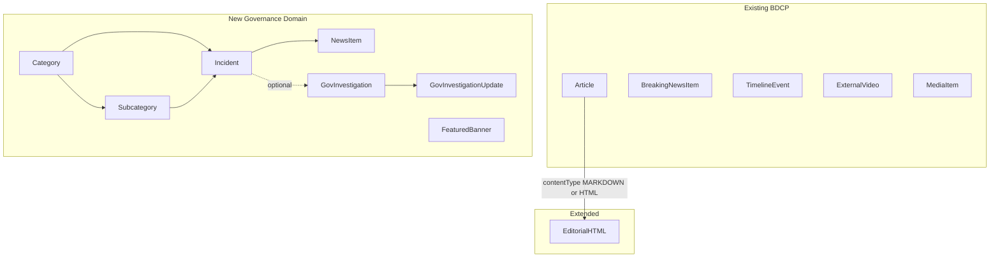

# Governance Accountability Tracker — Implementation Plan

## Current state vs target

BDCP today is a **bilingual measles media archive** ([`apps/api/prisma/schema.prisma`](apps/api/prisma/schema.prisma), [`apps/web/src/app/[locale]/`](apps/web/src/app/[locale]/)). It has solid foundations you reuse as-is:

| Capability | Status | Reuse |
|------------|--------|-------|
| Admin JWT auth (login, bootstrap, guard) | Done | [`apps/api/src/admin/`](apps/api/src/admin/), [`AdminGuard.tsx`](apps/web/src/components/admin/AdminGuard.tsx) |
| bn/en routing (`/[locale]/`, default `bn`) | Done | [`apps/web/src/i18n/`](apps/web/src/i18n/), [`messages/bn.json`](apps/web/messages/bn.json) |
| Translation pattern (entity + `*Translation` rows) | Done | Article, TimelineEvent, etc. |
| `EmbedPlatform` enum (`YOUTUBE`, `FACEBOOK`) | Done | Extend for News Item `sourceType` |
| `ReviewStatus` draft/publish | Done | Optional on new public entities |
| Breaking news ticker | Done | [`BreakingNewsItem`](apps/api/prisma/schema.prisma) — **keep** (different from Featured Banner) |
| Article CMS (markdown) | Done | Extend for editorial HTML (your choice) |
| Public cards, homepage grid | Partial | [`ArticleCard`](apps/web/src/components/ArticleCard.tsx) — pattern for new `IncidentCard` |

**Nothing in the repo yet** maps to Incident threads, linked News Items, category taxonomy CRUD, Government Investigation enums, Featured Banner cards, or URL metadata fetch.



---

## Gap analysis (spec section → status)

| Spec requirement | Gap | Notes |
|------------------|-----|-------|
| **2.1 Incident** (title, category, subcategory, linked news, derived stage/status) | **Full gap** | No model, API, or UI |
| **2.2 News Item** (URL, source type, headline, thumbnail, date, stage, status) | **Full gap** | Not the same as `Article` or `ExternalVideo` |
| **2.3 Stage auto-update** | **Full gap** | Service-layer rule on News Item create |
| **2.4 Government Investigation** (fixed enums, optional incident link) | **Full gap** | |
| **2.5 Featured Banner** (image, text, section type, prepend order) | **Full gap** | `BreakingNewsItem` is text ticker only; homepage “featured” is `articles[0]` hack in [`page.tsx`](apps/web/src/app/[locale]/page.tsx) |
| **3 Metadata auto-fetch** (`POST /admin/fetch-metadata`) | **Full gap** | No oEmbed/OG endpoint |
| **4.1 Homepage** (banner, category counts, incident feed, filter) | **Full gap** | Current homepage is article/timeline focused |
| **4.2 Incident detail + timeline** | **Full gap** | Closest: [`articles/[slug]`](apps/web/src/app/[locale]/articles/[slug]/page.tsx) |
| **4.3 Government Investigation page** | **Full gap** | |
| **5 Admin CRUD** (categories, incidents, investigations, banners) | **Partial** | Auth + admin shell exist; new nav sections needed |
| **6.5 Editorial HTML posts** | **Partial** | `ArticleTranslation.bodyMd` + `MarkdownBody`; needs `contentType` + `bodyHtml` + `HtmlBody` renderer |
| **bn/en everywhere** | **Pattern exists** | Apply dual headlines (your choice) + bilingual incident/category titles |

**Intentionally unchanged (coexist):** `/articles`, `/media`, `/timeline`, `/tags`, breaking ticker, videos, media URLs, sources admin.

---

## Data model (new Prisma models)

Add to [`schema.prisma`](apps/api/prisma/schema.prisma). Follow existing `Locale` + translation-table conventions.

### Taxonomy

```prisma
model Category {
  id            String
  slug          String @unique
  sortOrder     Int @default(0)
  translations  CategoryTranslation[]   // name per locale
  subcategories Subcategory[]
  incidents     Incident[]
}

model Subcategory {
  id           String
  categoryId   String
  slug         String
  translations SubcategoryTranslation[]
  incidents    Incident[]
  @@unique([categoryId, slug])
}
```

### Incidents + News Items

```prisma
enum NewsSourceType { YOUTUBE ARTICLE FACEBOOK }

model Incident {
  id              String
  slug            String @unique
  categoryId      String
  subcategoryId   String?
  currentStage    String          // derived from latest NewsItem
  currentStatus   String?         // derived
  reviewStatus    ReviewStatus
  createdAt       updatedAt
  translations    IncidentTranslation[]  // titleBn/titleEn via locale rows
  newsItems       NewsItem[]
  investigations  GovernmentInvestigation[]
}

model NewsItem {
  id            String
  incidentId    String
  sourceUrl     String
  sourceType    NewsSourceType
  headlineBn    String          // dual headline (your choice)
  headlineEn    String
  thumbnailUrl  String?
  publishedAt   DateTime?
  stage         String          // free text
  status        String?
  createdAt     // sequence = createdAt ASC
}
```

**Derived fields rule:** In `NewsItemsService.create()`, after insert, set `incident.currentStage = newsItem.stage`, `incident.currentStatus = newsItem.status`, bump `incident.updatedAt`.

**Public sort:** incidents `ORDER BY updatedAt DESC` (bubbles on new follow-up).

### Government Investigation

```prisma
enum GovInvestigationStage {
  INCIDENT_OCCURRED
  INVESTIGATION_PROMISED
  COMMITTEE_FORMED
  INVESTIGATION_ONGOING
  REPORT_SUBMITTED
  ACTION_TAKEN
  CLOSED_NO_ACTION
  CLOSED_RESOLVED
}

enum GovInvestigationStatus {
  ON_TRACK
  DELAYED
  STALLED
  RESOLVED
}

model GovernmentInvestigation {
  id              String
  incidentId      String?              // optional link
  currentStage    GovInvestigationStage
  currentStatus   GovInvestigationStatus
  translations    GovInvestigationTranslation[]
  updates         GovernmentInvestigationUpdate[]
}

model GovernmentInvestigationUpdate {
  id              String
  investigationId String
  sourceUrl       String
  sourceType      NewsSourceType
  headlineBn      headlineEn
  thumbnailUrl    publishedAt
  stage           GovInvestigationStage
  status          GovInvestigationStatus
  createdAt
}
```

**Computed (API, not stored):** `daysSinceLastUpdate` on list endpoints for stalled callouts.

**Label i18n:** Enum labels in [`messages/bn.json`](apps/web/messages/bn.json) / `en.json` (not DB), same pattern as `ReviewStatus` UI labels.

### Featured Banner

```prisma
model FeaturedBanner {
  id          String
  imageUrl    String
  captionBn   String
  captionEn   String
  sectionType String          // e.g. "Breaking", "Editor's Pick"
  createdAt   // sort DESC = prepend behavior
}
```

### Article extension (editorial HTML)

On `Article`:

```prisma
enum ArticleContentType { MARKDOWN HTML }
// Article.contentType ArticleContentType @default(MARKDOWN)
```

On `ArticleTranslation`:

```prisma
// bodyMd String? @db.Text   — required when contentType=MARKDOWN
// bodyHtml String? @db.Text — required when contentType=HTML
```

Admin form: toggle content type; public [`articles/[slug]/page.tsx`](apps/web/src/app/[locale]/articles/[slug]/page.tsx) renders `MarkdownBody` or new `HtmlBody` (`dangerouslySetInnerHTML`) based on type. SEO: use existing `seoDescription` for meta.

Shared types: extend [`packages/shared/src/index.ts`](packages/shared/src/index.ts) with enums used by both API DTOs and web.

---

## API surface (NestJS modules)

Mirror existing module layout ([`articles.module.ts`](apps/api/src/articles/articles.module.ts), [`admin-articles.controller.ts`](apps/api/src/admin/admin-articles.controller.ts)).

| Module | Public routes | Admin routes |
|--------|---------------|--------------|
| `categories` | `GET /categories` (with counts) | CRUD `/admin/categories`, `/admin/subcategories` |
| `incidents` | `GET /incidents`, `GET /incidents/:slug` | CRUD + `POST /incidents/:id/news-items` |
| `gov-investigations` | `GET /gov-investigations`, `GET /gov-investigations/:id` | CRUD + updates |
| `featured-banners` | `GET /featured-banners` | CRUD |
| `metadata` | — | `POST /admin/fetch-metadata { url }` |

**`fetch-metadata` implementation** ([`apps/api/src/admin/`](apps/api/src/admin/)):
1. Detect `sourceType` from URL host
2. YouTube → `https://www.youtube.com/oembed?url=...&format=json`
3. Article → server-side fetch + cheerio/regex for `og:title`, `og:image`, `article:published_time`
4. Facebook → `facebook.com/plugins/post/oembed.json/?url=...` (best-effort)
5. Return `{ sourceType, headline, imageUrl, publishedDate }` — admin form maps `headline` into both bn/en fields for admin to edit/translate

Guard with `AdminJwtGuard`. Timeout + user-agent; never block save on fetch failure.

**Stage autocomplete (spec open question):** `GET /admin/stages/suggest?q=` aggregating distinct `NewsItem.stage` values — Phase 3 polish.

---

## Web (Next.js) — public pages

Add routes under [`apps/web/src/app/[locale]/`](apps/web/src/app/[locale]/):

| Route | Purpose |
|-------|---------|
| `/` (extend) | Add governance section: Featured Banner strip + category count grid + incident feed; keep existing article/timeline blocks below or in tabs |
| `/incidents` | Full incident list with `?category=slug` filter |
| `/incidents/[slug]` | Timeline of News Items; “Latest Update” badge on most recent |
| `/investigations` | Gov investigation cards with colored stage/status badges + stalled callout |
| `/investigations/[id]` | Update timeline (enum labels) |

**New components** (reuse styling from `ArticleCard` / archive theme):
- `FeaturedBannerStrip` — horizontal scroll, `createdAt DESC`
- `CategoryCountGrid` — card per category with incident count from API
- `IncidentCard` — latest news thumbnail, dual headline by locale, stage/status badges, source icon
- `NewsItemTimeline` — vertical timeline with platform icons (newspaper / YouTube / Facebook)
- `GovInvestigationCard` — enum badges with locale labels
- `SourcePlatformIcon` — shared icon helper
- `HtmlBody` — raw HTML renderer for editorial articles

**Nav:** Add `incidents`, `investigations` to [`SiteHeader`](apps/web/src/components/SiteHeader.tsx) and [`messages/*.json`](apps/web/messages/). Keep existing archive links.

**Homepage featured articles:** Replace `articles[0]` hack with `FeaturedBanner` API; keep “latest articles” grid for archive/editorial content.

---

## Admin panel additions

Extend [`AdminShell.tsx`](apps/web/src/components/admin/AdminShell.tsx) nav:

- Categories / Subcategories
- Incidents (+ inline “Add News Item” on detail)
- Government Investigations
- Featured Banners
- Articles (existing — add content type toggle)

**Add News Item flow:**
1. Paste URL → blur → `POST /admin/fetch-metadata`
2. Pre-fill thumbnail, date, headline (copy to bn; admin fills en)
3. Admin edits stage (free text + suggest), status, both headlines
4. Save → triggers incident stage/status update

**Article form:** [`ArticleForm.tsx`](apps/web/src/components/admin/ArticleForm.tsx) — add `contentType` radio; show `bodyMd` textarea OR `bodyHtml` textarea per locale.

---

## Build phases (mapped to your spec + coexist)

### Phase 1 — Foundation
- Prisma migration: `Category`, `Subcategory`, `Incident`, `IncidentTranslation`
- Nest: categories admin CRUD + public list with counts
- Nest/Web: incidents admin create/list (manual fields only, no news items yet)
- Public: basic `/incidents` list (no filter yet)
- Seed: sample governance categories (Homicide, Corruption, etc.) bn/en
- **No changes** to existing archive seed data beyond additive rows

### Phase 2 — Linking and timeline
- Prisma: `NewsItem`
- Admin: add news item to incident (manual entry)
- Service: stage auto-update rule (2.3)
- Public: `/incidents/[slug]` timeline view
- `Incident.updatedAt` sort on list

### Phase 3 — Auto-fetch metadata
- `POST /admin/fetch-metadata` endpoint
- Wire into Add News Item form
- `GET /admin/stages/suggest` (optional autocomplete)
- Platform icons on cards

### Phase 4 — Dashboard polish
- Homepage: category grid + click-to-filter (`?category=`)
- `IncidentCard` with latest thumbnail
- Enable or stub hero search for incidents (API `q` on headline/stage)
- Reuse card styling across homepage, incident page, banners

### Phase 5 — Government Investigation tracker
- Prisma enums + models + admin CRUD
- Public `/investigations` with badge colors + `daysSinceLastUpdate` stalled callout
- Optional link to incident on admin form

### Phase 6 — Featured Banner + Editorial HTML
- `FeaturedBanner` CRUD + homepage strip
- Article `contentType` + `bodyHtml` migration + admin toggle + `HtmlBody` public render
- Update meta/brand copy in `messages/*.json` to reflect dual mission (archive + accountability) without removing archive routes

---

## Bilingual strategy (bn/en)

| Entity | Approach |
|--------|----------|
| Category / Subcategory / Incident title | `*Translation` rows (`locale` + `title`) — same as Article |
| News Item headline | **Dual fields** `headlineBn` + `headlineEn` on row (your choice); public picks by `locale` |
| Gov investigation title | Translation table |
| Featured Banner caption | `captionBn` + `captionEn` (like `BreakingNewsItem`) |
| Enum labels (gov stage/status) | UI strings in `messages/bn.json` / `en.json` |
| Editorial Article | Per-locale `bodyMd` or `bodyHtml` in `ArticleTranslation` |
| Auto-fetch | Returns one headline → pre-fill bn; admin translates en |

---

## Minor decisions (defaults unless you object)

- **Incident slug:** Auto from bn title + manual override in admin (same as article slugs)
- **Breaking ticker vs Featured Banner:** Keep both — ticker for text headlines, banner for image cards
- **ReviewStatus on incidents:** Default `PUBLISHED`; admin can draft before public
- **HTML sanitization:** Skip for v1 single-admin; document risk in admin UI
- **OG scrape failures:** Form always submittable with manual fields
- **Existing `TimelineEvent`:** Unchanged; not merged into Incident (coexist)

---

## Files touched (high level)

**API:** [`schema.prisma`](apps/api/prisma/schema.prisma), new modules under `apps/api/src/{categories,incidents,gov-investigations,featured-banners,metadata}/`, register in [`app.module.ts`](apps/api/src/app.module.ts), [`seed.ts`](apps/api/prisma/seed.ts)

**Web:** new `app/[locale]/incidents/`, `investigations/`, components under `components/governance/`, admin pages under `admin/(dashboard)/`, [`admin-api.ts`](apps/web/src/lib/admin-api.ts), [`api.ts`](apps/web/src/lib/api.ts), [`messages/bn.json`](apps/web/messages/bn.json) + `en.json`

**Shared:** [`packages/shared`](packages/shared/src/index.ts) enums

---

## Risk / dependency notes

- Regional newspaper OG scraping may fail server-side (anti-bot) — manual fallback is required from day one
- Facebook oEmbed is brittle without Graph API — treat as best-effort
- YouTube oEmbed gives no publish date — admin must enter date (or future YouTube Data API key)
- Coexist means homepage may get long — consider a clear visual split: “Accountability Tracker” section above “Media Archive” section
